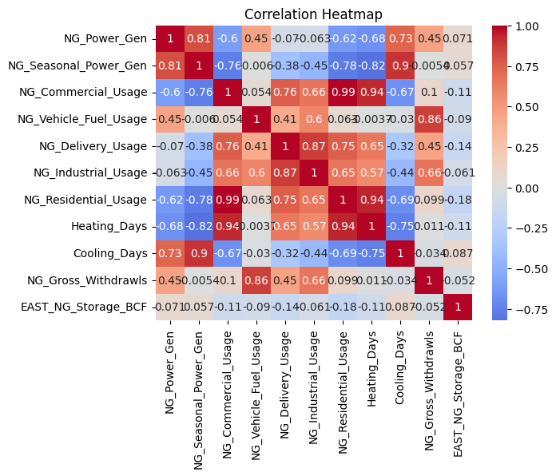
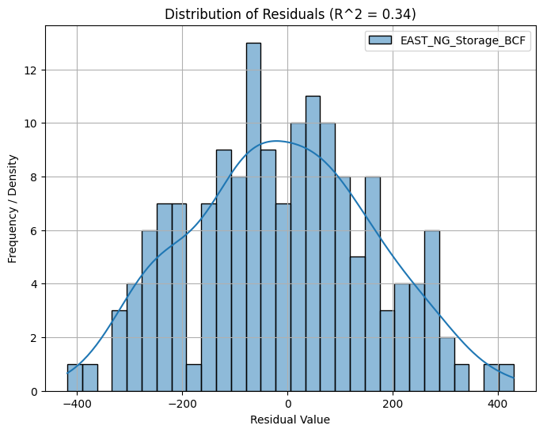

# Natural Gas Model

### 8/16 - Initial Features 
Completed [notebooks/raw_features.ipynb](notebooks/raw_features.ipynb). Includes integrations with EIA API, NOAA degree day data, upscaling + downscaling data to weekly frequencies, and introductory data visualizations.

Created first initial model with only raw features data:
